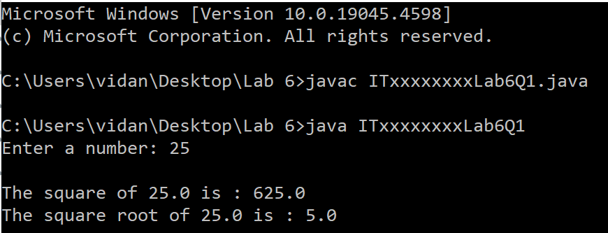
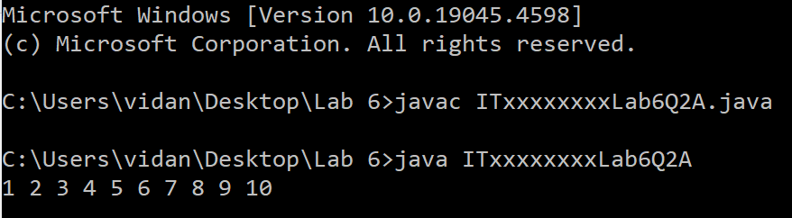
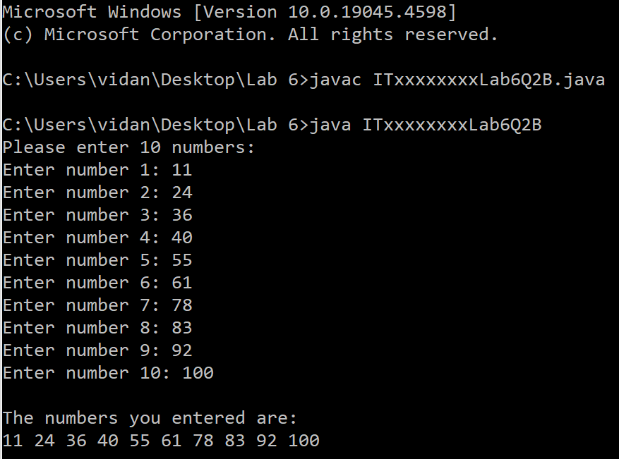
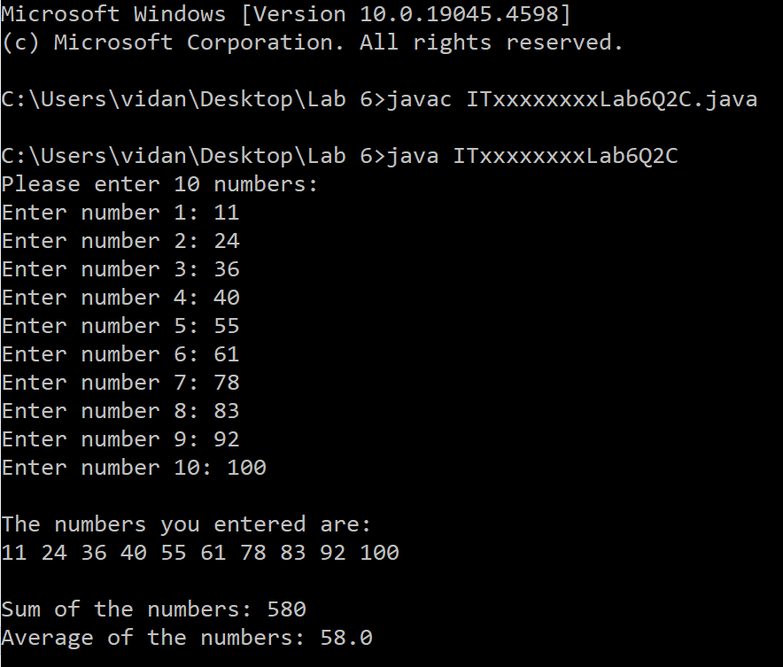
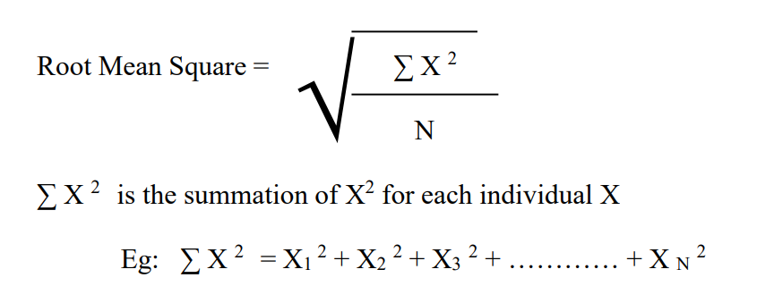
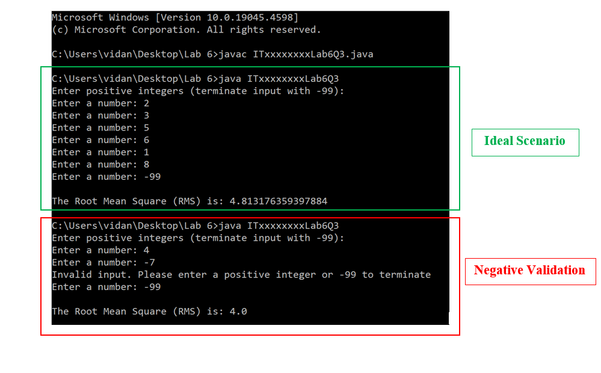

  

    
  

### Question 1 (Tutorial 5 -- Q2)

Write a Java program to display the [square]{.underline} and
[square-root]{.underline} of any number, input by the user.

Save the file inside '**Lab 6**' folder as: **ITxxxxxxxxLab6Q1.java**

Replace 'ITxx xxx xxx' of the filename, with your own Student ID.

Expected Output:

  

    
  

### Question 2 (Tutorial 3 -- Q4)

a)  Write a Java program to print the result of the following using a
    **[while loop]{.underline}**.

1 2 3 4 5 6 7 8 9 10

Save the file inside '**Lab 6**' folder as: **ITxxxxxxxxLab6Q2A.java**

Replace 'ITxx xxx xxx' of the filename, with your own Student ID.

Expected Output:

  

    
  

b)  Modify your Java program to enter 10 numbers from the keyboard as
    user input and print the result.

Save the file inside '**Lab 6**' folder as: **ITxxxxxxxxLab6Q2B.java**

Replace 'ITxx xxx xxx' of the filename, with your own Student ID.

Expected Output:

  

    
  

c)  Modify the program again to display the **Sum** and **Average** of
    the numbers entered.

Save the file inside '**Lab 6**' folder as: **ITxxxxxxxxLab6Q2C.java**

Replace 'ITxx xxx xxx' of the filename, with your own Student ID.

Expected Output:

  

    
  

### Question 3 (Tutorial 5 -- Q4)

Write a Java program to find the Root Mean Square of a series of
numbers.

You are required to enter a set of positive numbers (integers)
terminated by -99. Validate for negative input.

Use the following formula to find the Root Mean Square of the numbers
entered.

  

    
  

N is the number of numbers entered.

Save the file inside '**Lab 6**' folder as: **ITxxxxxxxxLab6Q3.java**

Replace 'ITxx xxx xxx' of the filename, with your own Student ID.

Expected Output:

  

    
  

  

    
  

